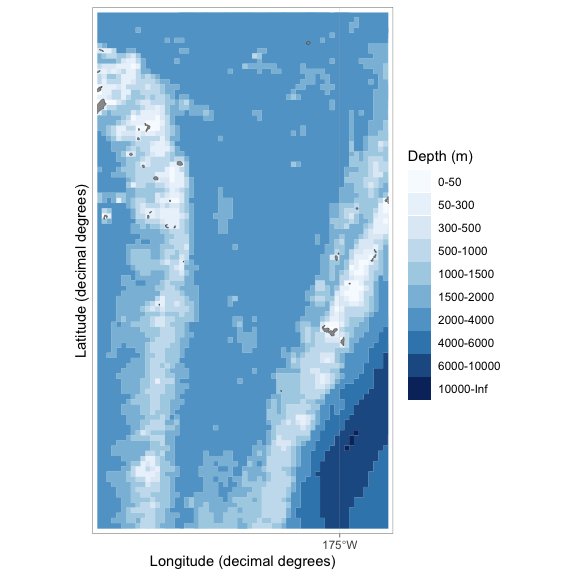
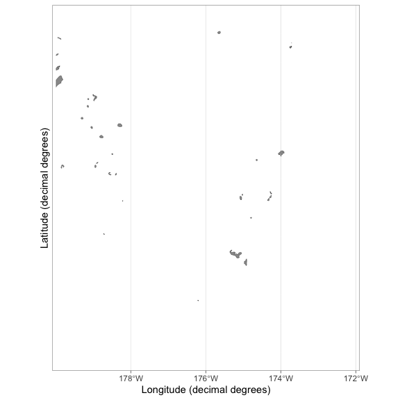
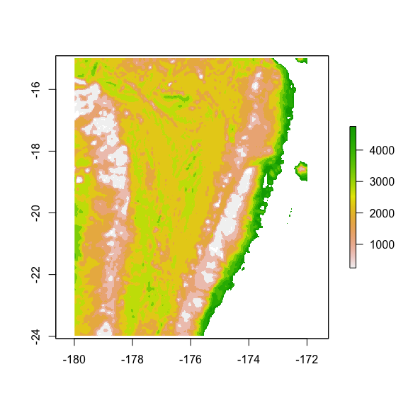
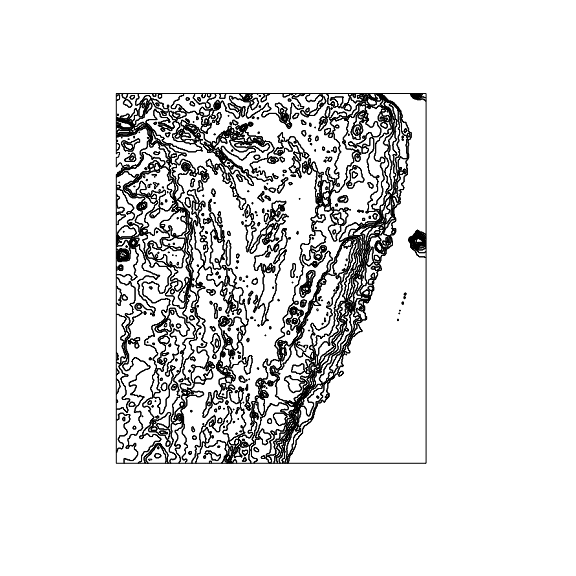
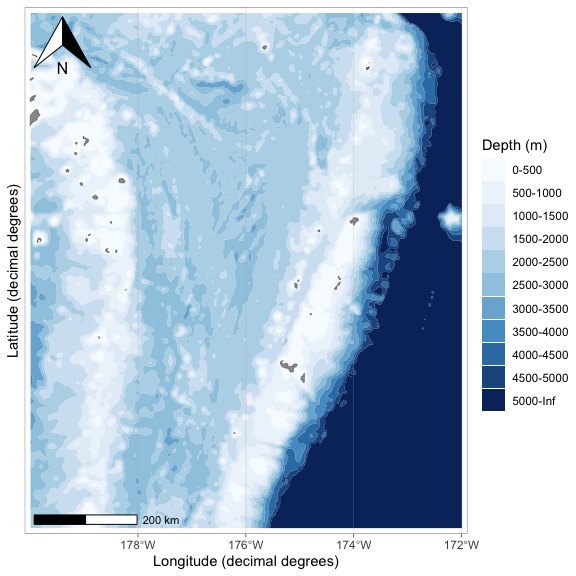
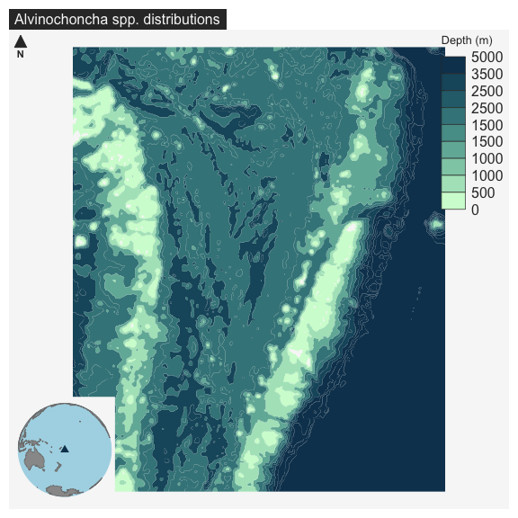

Working with ggOceanMaps and mapsf
================
Andy Jones
10/14/2021

# Installing the ggOceanMaps

``` r
# install.packages(c("ggOceanMapsLargeData", "ggOceanMaps"), 
#                  repos = c("https://cloud.r-project.org",
#                            "https://mikkovihtakari.github.io/drat"
#                  )
# )
```

# Trying out the basic plotting

``` r
library(ggOceanMaps)
library(ggOceanMapsData)

basemap(limits = c(-180, -174, -25, -15),
        bathymetry = TRUE, lon.interval = 5)
```

<!-- -->

# Pulling in some other bathymetry

See the walk through here.
<https://mikkovihtakari.github.io/ggOceanMaps/articles/ggOceanMaps.html>

``` r
#Pulling in some higher resolution bathymetry 
etopoPath <- "~/Desktop/ggOceanMaps/" # Replace by the path to the folder where the ETOPO1 grd file is located.
lims <- c(-180, -172, -24, -15)
projection <- "EPSG:39944 +proj=longlat"
basemap(limits = lims)
```

<!-- -->

``` r
rb <- raster_bathymetry(bathy = paste(etopoPath, "ETOPO1_Ice_g_gmt4.grd", sep = "/"),
                        depths = c(500,1000,1500,2000,2500,3000,3500,4000,4500,5000), 
                        proj.out = projection, 
                        boundary = lims
)
```

    ##   |                                                                              |                                                                      |   0%  |                                                                              |============                                                          |  17%  |                                                                              |=======================                                               |  33%  |                                                                              |===================================                                   |  50%  |                                                                              |===============================================                       |  67%  |                                                                              |==========================================================            |  83%  |                                                                              |======================================================================| 100%

``` r
raster::plot(rb$raster)
```

<!-- -->

``` r
bs_bathy <- vector_bathymetry(rb)
```

    ##   |                                                                              |                                                                      |   0%  |                                                                              |============                                                          |  17%  |                                                                              |=======================                                               |  33%  |                                                                              |===================================                                   |  50%  |                                                                              |===============================================                       |  67%  |                                                                              |==========================================================            |  83%  |                                                                              |======================================================================| 100%

``` r
sp::plot(bs_bathy)
```

<!-- -->

``` r
NEDPath <- "~/Desktop/ggOceanMaps/" # Natural Earth Data location
outPath <- "~/Desktop/ggOceanMaps/" # Data output location

world <- rgdal::readOGR(paste(NEDPath, "ne_10m_land/ne_10m_land.shp", sep = "/"))
```

    ## OGR data source with driver: ESRI Shapefile 
    ## Source: "/Users/Andy/Desktop/ggOceanMaps/ne_10m_land/ne_10m_land.shp", layer: "ne_10m_land"
    ## with 10 features
    ## It has 3 fields

``` r
islands <- rgdal::readOGR(paste(NEDPath, "ne_10m_minor_islands/ne_10m_minor_islands.shp", sep = "/"))
```

    ## OGR data source with driver: ESRI Shapefile 
    ## Source: "/Users/Andy/Desktop/ggOceanMaps/ne_10m_minor_islands/ne_10m_minor_islands.shp", layer: "ne_10m_minor_islands"
    ## with 2795 features
    ## It has 3 fields
    ## Integer64 fields read as strings:  scalerank

``` r
world <- rbind(world, islands)

bs_land <- clip_shapefile(world, lims)
#bs_land <- sp::spTransform(bs_land, CRSobj = sp::CRS(projection))
#rgeos::gIsValid(bs_land) # Has to return TRUE, if not use rgeos::gBuffer
bs_land <- rgeos::gBuffer(bs_land, byid = TRUE, width = 0)
#sp::plot(bs_land)

glaciers <- rgdal::readOGR(paste(NEDPath, "ne_10m_glaciated_areas/ne_10m_glaciated_areas.shp", sep = "/"))
```

    ## OGR data source with driver: ESRI Shapefile 
    ## Source: "/Users/Andy/Desktop/ggOceanMaps/ne_10m_glaciated_areas/ne_10m_glaciated_areas.shp", layer: "ne_10m_glaciated_areas"
    ## with 1886 features
    ## It has 5 fields
    ## Integer64 fields read as strings:  recnum scalerank

``` r
#rgeos::gIsValid(glaciers) # Needs buffering
glaciers <- rgeos::gBuffer(glaciers, byid = TRUE, width = 0)

bs_glacier <- clip_shapefile(glaciers, lims)
#bs_glacier <- sp::spTransform(bs_glacier, CRSobj = sp::CRS(projection))
#rgeos::gIsValid(bs_glacier)
#sp::plot(bs_glacier)
```

``` r
#save(bs_bathy, bs_land, bs_glacier, file = paste(outPath, "bs_shapes.rda", sep = "/"), compress = "xz")

library(ggspatial)

basemap(shapefiles = list(land = bs_land, glacier = bs_glacier,
                          bathy = bs_bathy), bathymetry = TRUE, glaciers = TRUE) +
  annotation_scale(location = "bl") + 
  annotation_north_arrow(location = "tl", which_north = "magnetic")
```

<!-- -->

\#Comparing to the mapsf

``` r
#Trying out this other package
library(mapsf)
library(tidyverse)

vent <- bs_bathy  %>% st_as_sf() %>% 
  mutate(depth_2=as.numeric(str_extract(depth, "[^-]+"))) %>%
  mf_map(var = "depth_2", type = "choro", pal = "Dark Mint", nbreaks = 9, leg_val_rnd = -2,
         leg_title = "Depth (m)", border = FALSE, leg_val_cex = 1, leg_pos = "topright")
 
mf_inset_on(x = "worldmap", pos = "bottomleft")
mf_worldmap(vent, col = "#0E3F5C")
mf_inset_off()
# Plot a layout elements
mf_title("Alvinochoncha spp. distributions")
#mf_scale(size = 0.25)
mf_arrow('topleft')
```

<!-- -->
